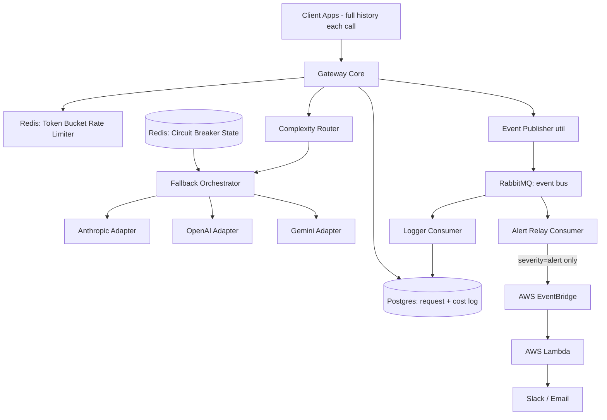

# Resilient LLM Gateway

A self-hosted gateway that sits between client applications and multiple LLM providers (Anthropic, OpenAI, Gemini). It solves three problems apps hit when calling providers directly:

1. **Fragility** — one provider going down or rate-limiting takes the whole app down.
2. **Cost blindness** — no visibility into what's being spent per feature.
3. **Cost inefficiency** — sending every request to an expensive model even when a cheap one would do.

It does this with per-key rate limiting, complexity-based routing, cross-provider fallback with circuit breakers, per-request cost/token logging, and an event-driven alerting path that ends in an AWS Lambda notification sink. There is no caching layer — see [`architecture.md`](./architecture.md) §12 for why.

## Status

**Build order steps 1–4 complete:** all three provider adapters, Redis-backed rate limiting, circuit breaker + cross-provider fallback, and complexity-based routing are wired up end to end — a request now picks its own tier, fails over across providers, and gets logged with real cost/token data. What's left is the internal event path and the AWS alert sink; alert-worthy events (`circuit_breaker.opened`, `tier_downgrade`, etc.) are currently structured log lines, not yet published anywhere.

| Step | What | Status |
|---|---|---|
| 1 | Gateway Core + one Provider Adapter + Postgres request logging | ✅ Done |
| 2 | Rate Limiter (Redis, Lua token bucket, tiered) | ✅ Done |
| 3 | Remaining adapters + Circuit Breaker + Fallback Orchestrator | ✅ Done |
| 4 | Complexity Router + tier-aware fallback + `tier_downgrade` | ✅ Done |
| 5 | Event Publisher + RabbitMQ + Logger Consumer | ⬜ Not started |
| 6 | Alert Relay + EventBridge + Lambda | ⬜ Not started |

## Architecture



Full design lives in [`architecture.md`](./architecture.md). The original brief is [`spec.md`](./spec.md); `architecture.md` overrides it wherever they disagree. Repo/engineering conventions (logging, error handling, testing, git workflow) live in [`CLAUDE.md`](./CLAUDE.md).

## Tech stack

- Node.js + TypeScript
- Express 5.x
- Redis (rate-limiter buckets, circuit-breaker state)
- Postgres (request cost/token log, event audit log)
- RabbitMQ (internal event bus) — not yet wired up
- AWS EventBridge + Lambda (alert sink) — not yet wired up

## Getting started

**Prerequisites:** Node.js 22+, Docker Desktop, API keys for Anthropic, OpenAI, and Gemini.

```bash
npm install
cp .env.example .env   # fill in the three provider API keys; DATABASE_URL/REDIS_URL defaults match docker-compose

docker compose up -d   # starts local Postgres + Redis (dev and test instances of each)
npm run migrate         # applies schema to $DATABASE_URL

npm run dev             # starts the gateway on $PORT (default 3000)
```

### Try it

```bash
curl http://localhost:3000/v1/completions \
  -H "Content-Type: application/json" \
  -H "x-api-key: local-dev-key" \
  -d '{
    "feature_id": "capital-qa",
    "messages": [{ "role": "user", "content": "What is the capital of France?" }]
  }'
```

`task_type` is an optional field on the request body (e.g. `"summarization"`, `"debugging"`) that hints the Complexity Router toward the cheap or capable tier — see `architecture.md` §6.3. Without it, the router falls back to heuristics on the latest message (length, code blocks, reasoning keywords).

## Testing

Tests are the backbone of this project — see `CLAUDE.md` "Testing" for the full philosophy (TDD, unit-first for logic, e2e against real local services).

```bash
npm test          # unit tests
npm run test:e2e   # e2e tests, requires `docker compose up -d` running
npm run test:all   # both
npm run ci          # the full pre-push gate: typecheck -> lint -> unit -> e2e -> build
```

A Husky `pre-push` hook runs `npm run ci` automatically and blocks the push on any failure.

## Project docs

- [`spec.md`](./spec.md) — original technical spec, with revision history
- [`architecture.md`](./architecture.md) — current authoritative system design
- [`CLAUDE.md`](./CLAUDE.md) — conventions: logging, error handling, testing, git workflow
- [`docs/design/`](./docs/design/) — per-feature HLD/LLD design docs (one folder per build-order step from step 2 onward), the paper trail behind how each component got built
