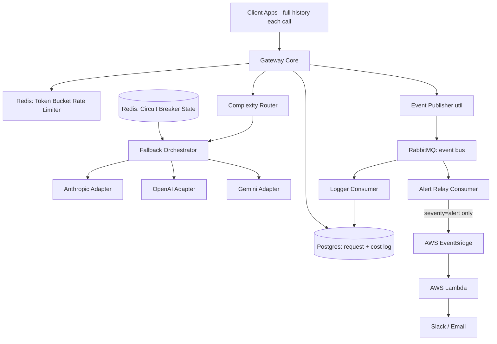

# Resilient LLM Gateway — Architecture

This document reflects the actual build decisions for this project. It supersedes the original spec (`spec.md`) wherever the two disagree — most notably: **there is no caching layer**. See "Deviations from original spec" at the bottom for the full diff and rationale.

## 1. Purpose

A self-hosted gateway between client applications and multiple LLM providers (Anthropic, OpenAI, Gemini) that solves:

1. **Fragility** — one provider going down or rate-limiting takes the whole app down.
2. **Cost blindness** — no visibility into what's being spent per feature.
3. **Cost inefficiency** — sending every request to an expensive model even when a cheap one would do.

Solved via per-key rate limiting, complexity-based routing, cross-provider fallback with circuit breakers, per-request cost/token logging, and an event-driven alerting path ending in an AWS Lambda notification sink.

## 2. Scope & Non-Goals

**In scope:** stateless, task-based LLM calls (summarization, classification, doc Q&A, content generation). The client sends the full message history with each request — the gateway does not maintain conversation state.

**Non-goals:**
- Not a persistent chatbot session manager (no server-side thread state).
- No frontend / dashboard. Alerting ends at a Slack/email message; observability of events is via logs + Postgres.
- No ML-based routing or classification — all routing decisions are heuristic (see §6.4). A wrong heuristic route is recoverable; a wrong learned-model route silently returns a bad answer.
- No caching layer (see "Deviations from original spec").
- No usage-based (monthly/weekly LLM-token) quota enforcement. The Rate Limiter (§6.2) controls request *rate* only, not cumulative token *spend* — those are distinct concerns with different time windows (seconds/minutes vs. weeks/months), different trigger points (pre-request vs. only checkable post-response, once real token counts are known), and different sources of truth (Redis token bucket vs. an aggregate over the `requests` table). Revisit as its own feature if/when usage-based billing is needed.

**Accepted tradeoffs:**
- Routing across providers forfeits provider-specific perks (e.g. prompt-caching discounts).

## 3. Tech Stack

- **Language/runtime:** Node.js + TypeScript
- **HTTP framework:** Express 5.x
- **Redis:** rate-limiter buckets, circuit-breaker state
- **Postgres:** per-request cost/token log + event audit log
- **RabbitMQ:** internal event bus
- **AWS:** EventBridge (event routing rule) + Lambda (alert sender)

No embedding model / vector search dependency — removed along with caching.

## 4. High-Level Architecture

## 5. Request Lifecycle (happy path)

1. Client sends a completion request with an API key, full message history, and an optional `task_type` hint.
2. **Rate Limiter** checks the key's tier bucket (free/pro/enterprise). Empty → reject 429 + fire `rate_limit.exceeded`.
3. **Complexity Router** scores the request and picks a tier, producing an ordered provider list.
4. **Fallback Orchestrator** consults **Circuit Breaker state**, picks the first healthy provider in the list, calls it via its **Adapter**.
5. On success → return response; **Gateway Core** logs `{provider, tier, prompt_tokens, completion_tokens, cost, latency}` to Postgres.

## 6. Components

### 6.1 Gateway Core
Owns the request lifecycle and orchestrates every other component. The only component that writes the per-request cost/token row to Postgres (it's the only place that has the final provider, token counts, and latency after the call returns).

### 6.2 Rate Limiter (Redis, token bucket, tiered)
- **Per-API-key**, not per-provider. Stops one client starving others / burning the budget.
- **Algorithm:** token bucket — capacity `C`, refill rate `R` tokens/sec, looked up per key's tier. Every request costs a flat 1 token (no prompt-size weighting — kept simple deliberately; revisit only if flat cost proves to be a poor proxy for provider load).
- **Tiers:**

  | Tier | Capacity C | Refill R | Sustained rate |
  |---|---|---|---|
  | free | 20 | 0.33/sec | ~20 req/min |
  | pro | 60 | 1/sec | ~60 req/min |
  | enterprise | 120 | 2/sec | ~120 req/min |

  Key → tier mapping stored in Postgres (`api_keys` table, §9) and cached in-process or read per-request; not re-derived from Redis.
- **Atomicity:** check-refill-deduct must be one atomic op. Implement as a Lua script via `EVAL` (Redis runs Lua single-threaded → no race). `rate-limiter-flexible` (npm) implements this pattern if not hand-rolling.
- Fires `rate_limit.exceeded` on rejection.

### 6.3 Complexity Router
- Pure decision function. Input: request. Output: ordered provider list (a tier). Does **not** call providers, does **not** log.
- **Tiers:** `complex` → `[Anthropic, OpenAI]`; `simple` → `[Gemini]`.
- **Heuristics (no ML):** caller-supplied `task_type` hint (most reliable) → else prompt length, presence of code blocks, reasoning keywords ("explain step by step", "prove", "debug").

  Note: "tier" here means *model-routing tier* (complex/simple), distinct from the *rate-limit tier* (free/pro/enterprise) in §6.2. Same word, two unrelated axes — don't conflate them in code (name the types `RoutingTier` and `RateLimitTier` or similar).

### 6.4 Circuit Breaker (Redis state)
- **Per-provider** state stored in Redis (shared across gateway instances — one source of truth, avoids instance A thinking a provider is dead while instance B keeps hammering it).
- **Stored per provider:** `state (closed|open|half-open)`, `failure_count`, `opened_at`.
- **Config:** `N=5` (failure threshold), `W=60s` (window), `T=30s` (cooldown).
- **Transitions:**
  - closed → fail → increment `failure_count`; 5 failures within 60s → **open**, set `opened_at`, fire `circuit_breaker.opened`.
  - open → all calls skipped until 30s elapses since `opened_at`.
  - after cooldown → **half-open** → allow one test request. Success → close, reset, fire `circuit_breaker.closed`. Fail → back to open, reset cooldown.
- **Atomicity:** increment + threshold-check + state-flip in one Lua `EVAL` (concurrent failures from multiple instances must not double-count or stomp).

### 6.5 Fallback Orchestrator
- Takes the Router's ordered provider list, filters out providers whose breaker is open, calls the first healthy one via its Adapter.
- On failure → increment that provider's breaker count, retry next provider **in the same tier**.
- If every provider in the tier is open → cross to the cheap tier as a last resort AND fire `tier_downgrade` (a hard request answered by a weak model is a correctness concern, flagged separately from availability).

### 6.6 Provider Adapters
- One per provider (Anthropic, OpenAI, Gemini). Normalize the gateway's internal request/response shape to/from each provider's API (including translating the full message history into each provider's message format). Core logic stays provider-agnostic.

### 6.7 Event Publisher
- Shared utility `publish(eventType, payload, severity)` — **not** a standalone watcher. Components call it directly when their own state changes.
- Writes to RabbitMQ only (single write path). Every event carries a `severity` (`info` | `alert`).

### 6.8 RabbitMQ (event bus)
- Single fan-out point. Two independent consumers:
  - **Logger Consumer** → writes every event to the Postgres event-audit table.
  - **Alert Relay Consumer** → filters `severity=alert`, forwards only those to AWS EventBridge via the AWS SDK (`PutEvents`).

### 6.9 AWS EventBridge + Lambda (alert sink)
- **EventBridge:** a rule matching `{"detail": {"severity": ["alert"]}}` targets the Lambda. Filtering lives in config, not code — new alert conditions don't require redeploying.
- **Lambda:** receives the event, formats it, POSTs to a Slack webhook / sends email. ~20 lines. Kept off local infra deliberately — the only cloud piece, an isolated notification sink that can be swapped/removed without touching core failover logic. Lambda can't natively subscribe to RabbitMQ, which is *why* EventBridge exists in the design — it's the door Lambda listens at.

## 7. Events

| Event | Published by | Severity | Reaches Lambda? |
|---|---|---|---|
| `circuit_breaker.opened` | Circuit Breaker | alert | yes |
| `tier_downgrade` | Fallback Orchestrator | alert | yes |
| `circuit_breaker.closed` | Circuit Breaker | info | no (logged only) |
| `rate_limit.exceeded` | Rate Limiter | info | no (logged only; fires often, would be alert-noise) |

All events → RabbitMQ → Postgres audit. Only `alert` → EventBridge → Lambda → Slack.

## 8. Data Model (Postgres)

**`requests`** (per-request cost log, written by Gateway Core)
`id, api_key_id, feature_id, provider, tier, prompt_tokens, completion_tokens, cost_usd, latency_ms, created_at`

Note: no `cache_hit` column — there is no cache. (Diverges from original spec.)

**`events`** (audit log, written by Logger Consumer)
`id, event_type, severity, payload_json, created_at`

**`api_keys`** (key → rate-limit tier mapping; not in original spec, added to support tiered rate limiting)
`id, key_hash, tier (free|pro|enterprise), created_at`

## 9. Deployment Split

- **Local / self-hosted:** Gateway Core, Redis, Postgres, RabbitMQ, Logger Consumer, Alert Relay Consumer.
- **AWS:** EventBridge (rule/config) + Lambda (alert code).
- The Alert Relay is the only component that talks to AWS (SDK `PutEvents`).

## 10. Build Order

1. Gateway Core + one Provider Adapter (end-to-end single-provider passthrough) + Postgres request logging.
2. Rate Limiter (Lua token bucket, tiered).
3. Add remaining adapters + Circuit Breaker + Fallback Orchestrator (multi-provider failover working).
4. Complexity Router + tier-aware fallback + `tier_downgrade`.
5. Event Publisher + RabbitMQ + Logger Consumer (internal event path).
6. Alert Relay + EventBridge + Lambda (AWS alert path) — last, since it's optional polish on top of a working gateway.

(Original spec's step 5, "Semantic Cache + Volatile-Content Filter," is removed — see below.)

## 11. Resolved Config Values

- Rate limiter: flat 1 token per request. Tiers: free (C=20, R=0.33/s), pro (C=60, R=1/s), enterprise (C=120, R=2/s).
- Circuit breaker: N=5, W=60s, T=30s.

## 12. Deviations from Original Spec

**Caching removed entirely** (Semantic Cache §6.3 and Volatile-Content Filter §7 in the original spec no longer exist in this build).

Rationale: the semantic cache's core failure mode — near-duplicate prompts ("weather in Kanpur" vs "weather in Nagpur") scoring high similarity but needing different answers — was already flagged as an accepted risk in the original spec (§2, §6.3) rather than a solved problem. A cache hit that's silently wrong is a worse bug than a cache miss, and the amount of infrastructure required to support it (Redis Stack vector search, an embedding model/API dependency, per-entry TTL tuning, per-feature similarity thresholds, plus the Volatile-Content Filter as a safety net) was judged not worth that risk for v1. The three core problems this gateway solves (fragility, cost blindness, cost inefficiency — §1) are fully addressed without it: rate limiting + circuit breaker + fallback handle fragility, Postgres logging handles cost blindness, and the Complexity Router handles cost inefficiency.

If a caching layer is revisited later, prefer **exact-match caching** (hash of normalized prompt + `feature_id` + `model_tier` as a plain Redis key with TTL) over semantic/vector similarity — it's deterministic, has no parametric-prompt risk, and needs no embedding dependency or vector index.

**Added:** `api_keys` table (§8) to support tiered rate limiting, which wasn't specified in the original spec's data model.

**HTTP framework: Express (5.x), not Fastify.** The original spec listed "Fastify (or Express)" as interchangeable. Settled on Express for developer familiarity — none of the gateway's actual complexity (rate limiter, circuit breaker, router, fallback orchestrator) is framework-dependent, and the gateway is I/O-bound on slow provider calls, so Fastify's routing-layer performance edge isn't the bottleneck here. Tradeoff: Express has no built-in per-request child logger or schema validation the way Fastify does, so both are wired manually — see `CLAUDE.md`'s Logging section for how ALS + Pino are bound per-request without Fastify's auto-wiring. Must be Express 5.x, not 4.x — 5.x auto-catches rejected promises in async route handlers.
