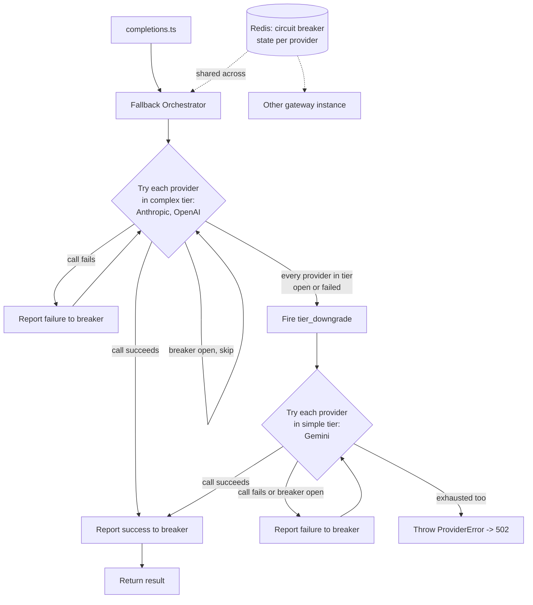
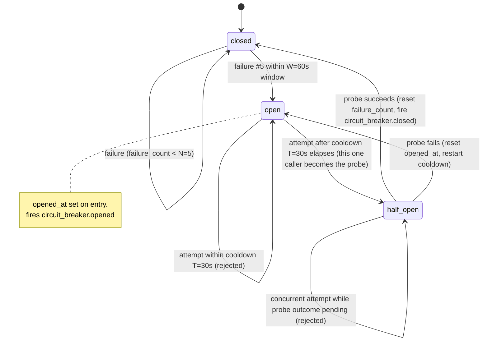
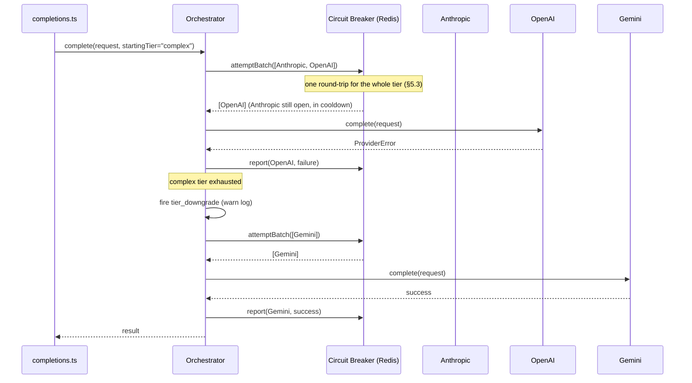

# HLD: Circuit Breaker + Fallback Orchestrator

**Status:** Finalized
**Build order:** step 3 (`architecture.md` §10)
**Related:** `architecture.md` §6.4 (Circuit Breaker), §6.5 (Fallback Orchestrator), §6.3 (Complexity Router tiers)

## 1. Problem Statement

Today, `completions.ts` takes a single hardcoded `ProviderAdapter` (Anthropic) and calls it directly:

```ts
const result = await adapter.complete({ messages: body.messages, taskType: body.task_type });
```

This is the passthrough built in step 1, and it has held even though OpenAI and Gemini adapters now exist (step 3's adapter half, PR #5) — because nothing in the request path knows how to choose between providers or react to one being unhealthy. Concretely, today:

- **One provider failing takes the whole gateway down for every request**, even though two other fully working adapters sit unused in the codebase. If Anthropic has an outage, every `/v1/completions` call fails with a 502 — there's no fallback to OpenAI or Gemini.
- **A failing provider gets hit on every single request, forever**, with no backoff. If Anthropic is down, the gateway keeps sending it traffic (and eating its latency/timeout cost) on every request instead of noticing the pattern and giving it a rest.
- **No shared state across gateway instances.** Even if we added a naive in-process "skip Anthropic for a while" flag, it wouldn't be seen by other gateway instances behind the same load balancer — each would have to independently rediscover the outage.

This is exactly the "Fragility" problem `architecture.md` §1 names as the gateway's first reason to exist, and it's currently unsolved. §6.4–6.5 already specify the fix (circuit breaker + fallback orchestrator); this PR implements it.

## 2. Proposed Solution

Two new components, both Redis-backed so state is shared across gateway instances (consistent with the rate limiter's approach):

- **Circuit Breaker** — per-provider health state (`closed` / `open` / `half-open`) in Redis. Tracks recent failures; once a provider crosses a failure threshold, the breaker "opens" and the orchestrator stops sending it traffic for a cooldown period, instead of learning that fact fresh on every request.
- **Fallback Orchestrator** — replaces the direct `adapter.complete()` call in `completions.ts`. Given an ordered provider list, it skips providers whose breaker is open, tries the rest in order, and reports each attempt's outcome back to the breaker.

The Complexity Router (which *chooses* the tier per request) is step 4, not this PR. What already exists, fixed, in `architecture.md` §6.3 is the tier→provider **mapping**: `complex` → `[Anthropic, OpenAI]`, `simple` → `[Gemini]`. This PR consumes that fixed mapping as config, keeps `completions.ts`'s existing `ROUTING_TIER = "complex"` hardcode as the *starting* tier (unchanged from today), and adds the ability to cross into the `simple` tier as a last resort — which is what turns this into genuine multi-provider failover instead of just "retry within one list."

### 2.1 High-level flow



## 3. Circuit breaker state machine



- **Key:** `circuitbreaker:{provider}` → Redis hash `{state, failure_count, opened_at}`.
- **Config (per `architecture.md` §11):** `N=5` failures, `W=60s` window, `T=30s` cooldown.
- Per-provider only (no per-instance state) — matches §6.4's requirement that breaker state be shared across gateway instances, so instance A doesn't keep hammering a provider instance B has already learned is down.

## 4. Two atomic operations, not one

Unlike the rate limiter's check-refill-deduct (which fits in a single `EVAL` because it doesn't span I/O — see `docs/design/rate-limiter/hld.md` §4.3), a circuit breaker's "check" and "record result" are separated by the actual provider HTTP call. You cannot hold a Lua script open across a network round-trip, so this is **two** separate atomic Lua scripts, called before and after the adapter call:

### 4.1 `circuitBreakerAttempt` — before invoking the adapter, per-provider semantics
- `closed` → allow.
- `open`, cooldown not yet elapsed → reject (orchestrator skips to next provider).
- `open`, cooldown elapsed → atomically flip to `half-open`, allow **exactly one caller through as the probe**. Concurrent callers arriving while already `half-open` → reject (prevents a thundering herd of test requests hitting a provider that just started recovering).

This logic runs per provider key, but it's exposed to the orchestrator as **one batched call across every provider in a tier**, not N separate round-trips — see §5.3 for why and the actual script.

### 4.2 `circuitBreakerReport(provider, success)` — after the adapter call resolves/rejects
- `closed` + failure → increment `failure_count`; crossing `N=5` within `W=60s` → flip to `open`, set `opened_at`, fire `circuit_breaker.opened`.
- `closed` + success → reset `failure_count` to 0.
- `half-open` + success → flip to `closed`, reset `failure_count`, fire `circuit_breaker.closed`.
- `half-open` + failure → flip back to `open`, reset `opened_at` (cooldown restarts).

## 5. Fallback Orchestrator control flow



Only a `ProviderError` thrown by an adapter triggers fallback to the next provider — a bug inside the orchestrator itself (programmer error) is not caught-and-retried against another provider, per CLAUDE.md's "no silent failures." If every provider in both tiers is skipped or fails, the orchestrator throws `ProviderError` ("all providers unavailable"), which the existing error handler already maps to 502.

### 5.1 Breaker-report calls are awaited, but isolated in their own try/catch

`circuitBreakerAttempt` and `circuitBreakerReport` are **awaited**, not fire-and-forget — consistent with how `completions.ts` already awaits `requestsRepo.logRequest(...)` before responding (routes/completions.ts:44), and needed so a Redis failure during reporting is caught and logged with ALS context rather than becoming an unhandled rejection (CLAUDE.md "no silent failures").

The risk with awaiting is if a Redis failure during `circuitBreakerReport` were allowed to propagate up through the *same* try/catch guarding the provider call — that would abort the fallback loop instead of moving to the next provider. The fix is isolation, not fire-and-forget: wrap each breaker call in its own helper that swallows its own errors (logs at `warn`, per §6's fail-open posture) and never rethrows, so its rejection can never reach the loop that decides "try the next provider":

```ts
async function safeAttemptBatch(circuitBreaker: CircuitBreaker, providers: string[]): Promise<string[]> {
  try {
    return await circuitBreaker.attemptBatch(providers); // one Redis round-trip for the whole tier, see §5.3
  } catch (err) {
    getLogger().warn({ err, providers }, "circuit breaker batch attempt failed");
    return providers; // fail open — Redis being down shouldn't block trying every provider
  }
}

async function safeReport(circuitBreaker: CircuitBreaker, provider: string, success: boolean): Promise<void> {
  try {
    await circuitBreaker.report(provider, success);
  } catch (err) {
    getLogger().warn({ err, provider }, "circuit breaker report failed");
    // deliberately swallowed — a bookkeeping write failing must not affect
    // the fallback decision, which was already made by the adapter call
  }
}

async function completeTier(request: GatewayCompletionRequest, tier: RoutingTier) {
  const providers = tierProviderList(tier);
  const healthy = await safeAttemptBatch(circuitBreaker, providers); // filters out open breakers in one call

  for (const provider of healthy) {
    try {
      const result = await adapters[provider].complete(request);
      await safeReport(circuitBreaker, provider, true);
      return result;
    } catch (err) {
      if (!(err instanceof ProviderError)) throw err; // programmer error — don't swallow, don't fall back
      await safeReport(circuitBreaker, provider, false);
      // falls through to the next healthy provider
    }
  }
  return null; // every provider in this tier was skipped (open) or failed
}

async function complete(request: GatewayCompletionRequest, startingTier: RoutingTier) {
  const result = await completeTier(request, startingTier);
  if (result) return result;

  getLogger().warn({ tier: startingTier }, "tier_downgrade");
  const otherTier = startingTier === "complex" ? "simple" : "complex";
  const fallbackResult = await completeTier(request, otherTier);
  if (fallbackResult) return fallbackResult;

  throw new ProviderError("all providers unavailable", "none");
}
```

Trace through the scenario that motivated this: Anthropic's adapter call throws `ProviderError` → caught → `safeReport(Anthropic, false)` is awaited → Redis is *also* down, so `circuitBreaker.report()` rejects → that rejection is caught **inside `safeReport`**, logged at `warn`, and `safeReport` resolves normally → the `for` loop's current iteration ends normally → OpenAI (already in the `healthy` list from the earlier batch read) is tried next. The Redis outage never reaches the loop's control flow, so fallback is unaffected — the isolation, not the absence of `await`, is what guarantees this. The same holds if Redis is down *before* the batch read even happens: `safeAttemptBatch` catches it and fails open by returning every provider in the tier unfiltered, so a total Redis outage degrades to "try every provider in list order with no breaker filtering," never to "reject the request."

### 5.2 Providers are tried sequentially, not raced in parallel

The `for` loop in §5 tries exactly one provider at a time — it only moves to the next after the current one's `adapter.complete()` call has settled (failed, or been skipped because its breaker is open). This is a deliberate choice, not just what the loop shape happens to produce, and it's what `architecture.md` §6.5 already specifies ("picks the first healthy provider... on failure → retry next provider in the same tier" — sequential language, not "race N providers").

The alternative — fire multiple providers concurrently and take whichever responds first — was rejected:

- **Cost.** Racing pays for N completions to use 1. That directly undermines the "Cost inefficiency" problem `architecture.md` §1 names as one of this gateway's core reasons to exist. Sequential only pays for extra calls on the failure path, which is the uncommon case; racing pays extra on *every* request, including ones where the first provider would have succeeded anyway.
- **Breaker reporting gets ambiguous under racing.** If Anthropic and OpenAI are fired simultaneously and Anthropic wins, what gets reported for OpenAI's still-in-flight call — abort and report nothing, wait for it anyway, treat a cancellation as a failure? Sequential avoids the question entirely: exactly one attempt/report pair per provider actually tried, each fully resolved before the next begins.
- **Latency cost is only paid on the failure path, which is when it's justified.** Happy path (first provider in the list, breaker closed, call succeeds) has zero added latency vs. today's single-adapter call. Sequential latency only stacks when the first provider is genuinely failing — at which point the breaker is also accumulating toward `open`, so subsequent *requests* skip straight past it. Racing would shave failure-path latency for this one request at the cost of paying full price for it on every request indefinitely.

### 5.3 Batched health lookup: one round-trip per tier, not one per provider

Checking each provider's breaker state one at a time — `attempt(Anthropic)`, then `attempt(OpenAI)`, each a separate awaited Redis round-trip — means the number of round-trips before reaching a healthy provider scales with how many *unhealthy* providers sit ahead of it in the list. That's fine at today's scale (2 providers in the `complex` tier), but it's the wrong shape to carry forward as the provider list grows, and there's no reason to pay per-provider round-trip latency for something Redis can answer in one call.

Instead, `circuitBreakerAttempt`'s per-key logic (§4.1) runs for **every provider in a tier inside a single Lua `EVAL`**, taking each provider's breaker key as one of Redis's multi-`KEYS` arguments. The orchestrator gets back the filtered, order-preserved list of providers it's allowed to try — one Redis round-trip for the whole tier, regardless of how many providers are in it.

This also resolves the "stuck half-open probe" question from earlier drafts: the half-open transition sets a lease TTL (`EXPIRE`) on the breaker key. If the probe caller crashes or times out before ever calling `circuitBreakerReport`, the key simply expires — the next `attemptBatch` call sees no key (`HMGET` returns nil), which the script treats as a fresh `closed` state, so a new attempt is granted rather than the breaker staying wedged open forever.

```lua
-- circuitBreakerAttemptBatch.lua
-- KEYS[1..N]  = circuitbreaker:{provider}, one per provider in the tier,
--               in the order the caller wants results back in.
-- ARGV[1]     = cooldown_seconds (T)
-- ARGV[2]     = half_open_lease_seconds (reused as T; see note above)
local cooldown = tonumber(ARGV[1])
local half_open_lease = tonumber(ARGV[2])

-- Redis's own clock, frozen for the life of this script -- not a timestamp
-- passed from Node -- so every gateway instance evaluates cooldowns against
-- the same clock (same reasoning as tokenBucket.lua).
local time = redis.call('TIME')
local now = tonumber(time[1]) + (tonumber(time[2]) / 1000000)

local allowed = {}

for i, key in ipairs(KEYS) do
  local data = redis.call('HMGET', key, 'state', 'opened_at')
  local state = data[1]
  local opened_at = tonumber(data[2])

  if state == false or state == 'closed' then
    allowed[i] = 1
  elseif state == 'open' and opened_at ~= nil and (now - opened_at) >= cooldown then
    -- Cooldown elapsed: this call becomes the single half-open probe for
    -- this provider. The lease TTL is the safety valve described above --
    -- a probe caller that never reports back just lets the key expire
    -- instead of wedging the breaker open permanently.
    redis.call('HSET', key, 'state', 'half_open', 'opened_at', tostring(now))
    redis.call('EXPIRE', key, half_open_lease)
    allowed[i] = 1
  else
    -- Still open (cooldown not elapsed) or half_open (a probe is already
    -- outstanding for this provider) -- either way, skip it.
    allowed[i] = 0
  end
end

return allowed
```

TypeScript side follows the same `defineCommand` pattern as `tokenBucket.ts` (`src/rateLimiter/tokenBucket.ts`), except `numberOfKeys` varies per call (a tier can have a different number of providers), so it's passed as the leading argument at call time instead of being fixed when the command is defined — standard raw-`EVAL` calling convention:

```ts
interface RedisWithCircuitBreaker extends Redis {
  circuitBreakerAttemptBatch(...args: (string | number)[]): Promise<number[]>;
}

export interface CircuitBreaker {
  attemptBatch(providers: string[]): Promise<string[]>; // returns the healthy subset, original order preserved
  report(provider: string, success: boolean): Promise<void>;
}

export function createCircuitBreaker(redis: Redis, config: { cooldownSeconds: number; halfOpenLeaseSeconds: number }): CircuitBreaker {
  const attemptLua = readFileSync(path.join(__dirname, "circuitBreakerAttemptBatch.lua"), "utf8");
  redis.defineCommand("circuitBreakerAttemptBatch", { lua: attemptLua }); // no numberOfKeys — variable per call

  return {
    async attemptBatch(providers) {
      const keys = providers.map((p) => `circuitbreaker:${p}`);
      const results = await (redis as RedisWithCircuitBreaker).circuitBreakerAttemptBatch(
        keys.length, ...keys, config.cooldownSeconds, config.halfOpenLeaseSeconds,
      );
      return providers.filter((_, i) => results[i] === 1);
    },
    // report(): circuitBreakerReport.lua, per the transition table in §4.2 —
    // full script written in the LLD.
    async report(provider, success) { throw new Error("not yet implemented — see LLD"); },
  };
}
```

Exact typing of the variable-arity `EVAL` call gets tightened up in the LLD (`ioredis`'s types don't model "N keys followed by M args" cleanly) — shown here to make the round-trip-collapsing shape concrete for review, not as final code.

## 6. Failure mode: Redis unreachable

Different posture from the rate limiter, deliberately. The rate limiter fails **closed** (503, reject all traffic) because it protects the gateway's own resources and Redis is a required dependency for that guarantee. The circuit breaker protects *providers*, not the gateway itself — an outage in breaker bookkeeping shouldn't cascade into a full gateway outage. Decision: `attemptBatch` / `report` failures (Redis down) are logged at `warn` and treated as "allow" — the orchestrator still tries providers in order, it just temporarily loses the "skip known-bad providers" optimization until Redis recovers. See §9.3 for the full rationale.

## 7. Event emission

Per the rate-limiter HLD's precedent (§6 there): `circuit_breaker.opened`, `circuit_breaker.closed`, `tier_downgrade` are all **logged** with full ALS context (`warn` for the alert-severity ones — `circuit_breaker.opened`, `tier_downgrade` — `info` for `circuit_breaker.closed`) instead of published, since RabbitMQ / Event Publisher don't exist until step 5. Same "swap the log call for `publish(...)` later" plan as `rate_limit.exceeded`.

## 8. Testing (per CLAUDE.md)

- **Unit — circuit breaker:** state transitions (closed→open→half-open→closed, half-open→open on probe failure), boundary at exactly `N=5` failures, cooldown boundary at exactly `T=30s`, half-open single-probe admission under concurrent callers. Lua-script test harness or fake Redis, mirroring the rate limiter's Lua test approach.
- **Unit — orchestrator:** provider-iteration and tier-crossing logic with fake adapters/breaker — pure control flow, no real Redis needed.
- **E2E:** real Redis, concurrent requests forcing a real breaker open/half-open cycle across multiple orchestrator instances sharing one Redis.
- Adapters continue to be mocked at the adapter boundary (per CLAUDE.md) — orchestrator tests don't hit real provider APIs.

## 9. Resolved design decisions

Three points that started as open questions during review, settled as follows:

1. **Stuck half-open probe** — resolved by the lease TTL in §5.3: `half-open` carries an `EXPIRE` of `half_open_lease_seconds` (reusing `T=30s`). A probe caller that crashes or times out without reporting back just lets the key expire; the next `attemptBatch` sees no key and treats the provider as fresh/`closed` rather than leaving it wedged open indefinitely.
2. **Failure window semantics** — going with the simpler approximation: reset `failure_count` to 0 on any success, and expire it back to 0 via a TTL refreshed only on failure (not a strict sliding window with a timestamp list per provider). Consistent with the rate limiter's "simplest correct thing, revisit if proven insufficient" precedent (`docs/design/rate-limiter/hld.md`).
3. **Redis-unreachable posture** — fail open, per §6: a breaker-bookkeeping outage degrades to "try every provider without breaker filtering," it does not reject requests the way the rate limiter's Redis outage does. §5.3's `safeAttemptBatch` implements this by returning the full unfiltered provider list on any Redis error.

## 10. Out of scope

Complexity Router itself (step 4 — per-request tier *selection*; this PR only consumes the fixed tier→provider config). RabbitMQ / Event Publisher (step 5 — events are logged for now, not published). Any admin/observability endpoint for breaker state.
