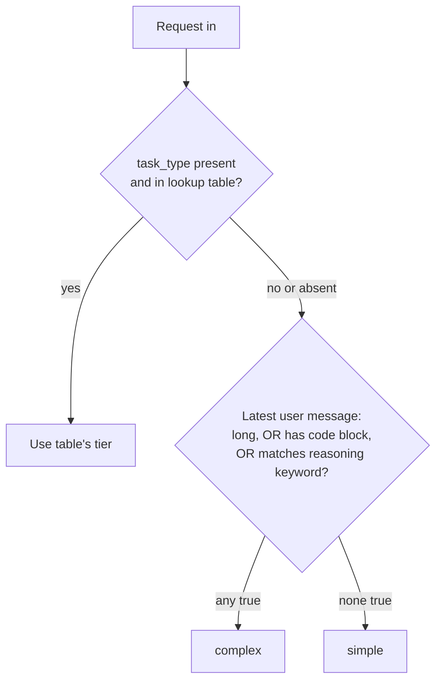

# HLD: Complexity Router

**Status:** Finalized
**Build order:** step 4 (`architecture.md` §10)
**Related:** `architecture.md` §6.3 (Complexity Router), §6.5 (Fallback Orchestrator, already consumes `RoutingTier`)

## 1. Problem Statement

`completions.ts` currently starts every single request in the `complex` tier, unconditionally:

```ts
// Hardcoded until the Complexity Router lands (build order step 4)...
const STARTING_TIER: RoutingTier = "complex";
```

This was a deliberate placeholder left by the circuit-breaker/orchestrator PR (`docs/design/circuit-breaker-fallback-orchestrator/hld.md` §10, "out of scope"). Everything downstream of tier *selection* already works: the Fallback Orchestrator takes a `RoutingTier` and knows how to route within it and downgrade out of it (`src/orchestrator/fallbackOrchestrator.ts`), and the tier→provider map already exists (`src/orchestrator/config.ts`). What's missing is the actual decision — the thing that makes this "cost inefficiency" (`architecture.md` §1) problem solved rather than just plumbed for: **every request currently pays for `[Anthropic, OpenAI]`-tier quality even when a simple classification or extraction task would do.**

## 2. Proposed Solution

A pure function, `chooseTier(request) -> RoutingTier`, with no side effects — no provider calls, no logging, no state. Matches CLAUDE.md's existing constraint ("The Complexity Router is a pure function... keep it that way so it stays unit-testable without mocks") and `architecture.md` §6.3 verbatim.

It replaces `STARTING_TIER` in `completions.ts`:

```ts
const tier = chooseTier(request); // was: const tier = STARTING_TIER;
const { result, tier: servedTier } = await orchestrator.complete(request, tier);
```

No changes to `RoutingTier`, `TIER_PROVIDERS`, or the orchestrator — this PR only produces the input they already consume.

### 2.1 Decision flow



Two-stage priority, matching §6.3's "caller-supplied `task_type` hint (most reliable) → else prompt length, code blocks, reasoning keywords":

1. **`task_type` lookup** — if the caller supplied a `task_type` that's a known key, trust it and skip heuristics entirely. This is the "most reliable" signal because the caller has direct knowledge of their own use case; a fixed table (not fuzzy matching) keeps it a deterministic, testable mapping instead of guessing at string similarity.
2. **Heuristic fallback** — only reached when `task_type` is absent or unrecognized. All three heuristics run against the **latest user message only** (not the full history — a long system prompt or an old turn shouldn't drag an otherwise-trivial follow-up into the `complex` tier), combined with OR: any one signal firing routes `complex`; none firing routes `simple`.

## 3. Detailed Design

### 3.1 `task_type` lookup table

```ts
const TASK_TYPE_TIER: Record<string, RoutingTier> = {
  summarization: "simple",
  classification: "simple",
  extraction: "simple",
  translation: "simple",
  code_generation: "complex",
  debugging: "complex",
  reasoning: "complex",
  analysis: "complex",
};
```

Exact-match, case-sensitive on the string the caller sends (consistent with `task_type` already being a free-form `z.string().optional()` in the request schema — no enum constraint is being added here, just a known-value lookup). An unrecognized `task_type` (typo, or a caller using their own vocabulary) falls through to heuristics rather than erroring — a bad hint shouldn't fail the request, per CLAUDE.md's "no silent failures" it will still get *routed*, just not via the hint.

### 3.2 Heuristics (all three, OR'd)

Scanned against `request.messages`, latest entry with `role: "user"`.

- **Prompt length:** `content.length > 600` characters (~150 tokens at a 4-chars/token rough estimate — consistent with not wanting to add a real tokenizer dependency just for routing). Chosen as a round number clearly above a typical short classification/extraction prompt and below a typical multi-paragraph task description; tune during review if it misclassifies real traffic once this ships.
- **Code block:** content contains a markdown fenced block, regex `` /```/ ``. Deliberately narrow — matches §6.3's "presence of code blocks" literally, and fenced blocks are the unambiguous signal (vs. e.g. a stray `{` or semicolon, which would false-positive on normal prose).
- **Reasoning keywords:** case-insensitive match against a fixed phrase list, seeded from §6.3's own examples plus a few obvious siblings:

  ```ts
  const REASONING_KEYWORDS = [
    "explain step by step",
    "step by step",
    "prove",
    "debug",
    "walk me through",
    "why does",
  ];
  ```

### 3.3 No signal fires → `simple`

Per review: default is `simple`, not `complex`. This is a change from today's implicit behavior (everything defaults to `complex` since `STARTING_TIER` is hardcoded) — the router is expected to actively route the *common* case (short, no-code, no-reasoning-keyword prompts) to the cheap tier, and only escalate on a positive signal. The Fallback Orchestrator's existing cross-tier downgrade logic is unaffected either way — this only changes the *starting* tier, and a `simple`-start request that turns out to need it can still only downgrade further (never up), so an under-routed hard request rides on `simple` tier's Gemini quality rather than escalating. Flagged here explicitly since it's the one place a wrong heuristic has a correctness cost rather than just a cost-efficiency one.

## 4. Interface

```ts
// src/router/complexityRouter.ts
export function chooseTier(request: GatewayCompletionRequest): RoutingTier;
```

Takes the same `GatewayCompletionRequest` the orchestrator and adapters already use (`src/adapters/types.ts`) — no new request type needed.

## 5. Testing (per CLAUDE.md)

Pure function, no mocks needed — this is the easy unit-test case CLAUDE.md calls out explicitly ("Complexity Router heuristics... precisely because the components are pure/deterministic and have no excuse for untested branches").

- Known `task_type` in the table → returns the table's tier, regardless of message content (table takes priority even over a message that would independently heuristic-match the other tier — verifies priority ordering).
- Unknown/absent `task_type` → falls through to heuristics.
- Each heuristic independently: exactly-at-boundary length (600 vs 601 chars), fenced code block present/absent, each keyword, case-insensitivity.
- Multiple heuristics firing at once → still `complex` (OR, not exclusive).
- No `task_type`, no heuristic match → `simple`.
- Heuristics only look at the latest user message — a test with a long/code-containing *earlier* message and a short, plain latest message still returns `simple`.
- No messages with `role: "user"` at all (edge case, e.g. malformed request) → falls through heuristics to `simple` rather than throwing; router should not be a new source of request failures — schema validation upstream is what rejects malformed requests, this stays pure and defensive.

## 6. Out of scope

Wiring `chooseTier`'s output into Postgres/event logging beyond what already exists (the orchestrator's returned `tier` is already logged as the *served* tier in `requestsRepo.logRequest`, unchanged by this PR). Tuning thresholds against real traffic — the length threshold and keyword list are a reasonable starting point, not a data-driven result. Any per-`feature_id` override of routing behavior (not in `architecture.md`, would be a separate feature).
